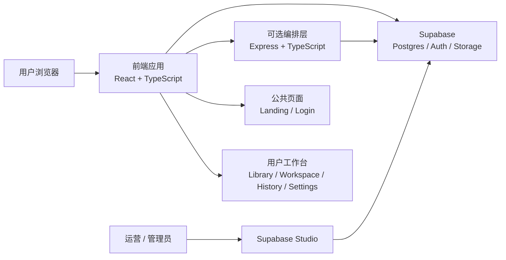
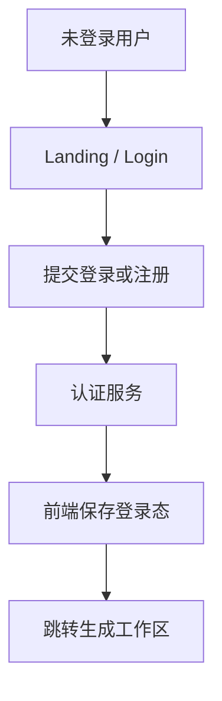
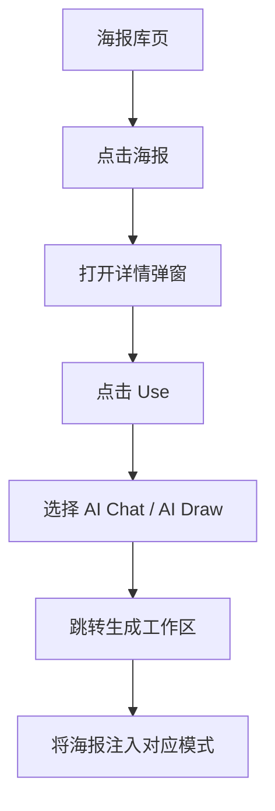
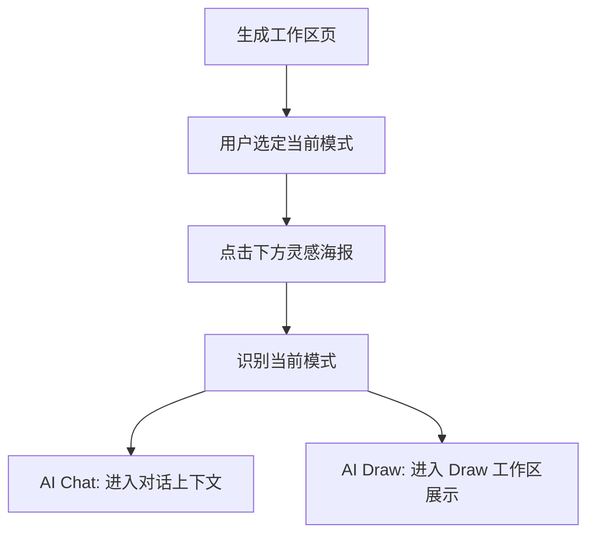

# MoviePainter 架构基线

本文档定义 MoviePainter 当前阶段的目标架构，用于指导后续页面实现、接口设计、数据建模与后台扩展。

## 一、架构目标

MoviePainter 的目标不是一个单页小工具，而是一套围绕“电影海报创作”展开的完整 Web 应用。

当前阶段需要支撑的核心能力：

- 未登录营销落地页
- 登录认证
- 海报库浏览与筛选
- `AI Chat / AI Draw` 双模式生成工作区
- 历史生成记录查看
- 个人设置管理
- 后台维护官方精选海报、详情信息、标签与推荐内容

## 二、当前工程现状与目标方向

当前仓库已经具备的 starter 底座：

- 前端：React + TypeScript + Vite + Tailwind
- 后端：Express + TypeScript
- 本地数据库：SQLite
- 本地认证：JWT + bcrypt

当前已落地的能力：

- 用户注册
- 用户登录
- 获取当前用户资料

但当前已经确认的目标方向是：

- 后台数据统一由 Supabase 管理
- 官方精选海报库统一由 Supabase 管理
- 用户所有业务数据统一由 Supabase 管理

因此，当前最合理的演进方向是：

- 保留现有前端技术栈
- 将 Supabase 作为数据、存储与后台管理底座
- 让 Express 逐步收敛为编排层 / AI 集成层 / 安全代理层

## 三、总体架构

## 四、分层结构

### 1. 前端分层

建议前端按以下层次组织：

- `app shell`
- `route pages`
- `feature modules`
- `shared ui`
- `api client`
- `state management`

建议页面层次：

- 公共层：landing、login、register
- 用户层：library、workspace、history、settings

建议功能模块：

- auth
- poster-library
- workspace-chat
- workspace-draw
- history
- settings

### 2. 后端分层

建议后端按以下层次组织：

- supabase client
- route
- controller
- service
- orchestration
- schema validation

建议业务域拆分：

- auth-session
- poster-library
- workspace
- generation
- history
- settings

## 五、核心业务域

### 1. 身份认证域

职责：

- 用户身份
- 登录态校验
- 用户资料读取
- 角色判断

说明：

- 当前 starter 中已有 Express + JWT 实现
- 目标方向推荐逐步迁移到 Supabase Auth

### 2. 海报库域

职责：

- 官方精选海报列表
- 顶部筛选
- 海报详情信息
- 海报推荐内容
- 海报到工作区的使用跳转

### 3. 工作区域

职责：

- `AI Chat` 模式
- `AI Draw` 模式
- 模式切换
- 海报灵感区
- 参考海报注入
- 生成任务提交

### 4. 生成任务域

职责：

- 记录每次生成请求
- 保存工作区模式
- 保存输入参数
- 保存参考海报
- 保存生成结果
- 保存任务状态

### 5. 用户中心域

职责：

- 历史生成记录
- 历史详情
- 个人设置

### 6. 后台管理域

职责：

- 官方精选海报管理
- 海报详情信息管理
- 参数标签管理
- 推荐内容管理
- 用户数据管理

当前阶段管理方式：

- 默认通过 Supabase Studio 管理真实数据
- 应用内同步建设一个后台管理页占位版本，先承载后台工作台结构与交互流程

## 六、前端页面架构

### 1. 营销 landing 页

职责：

- 面向未登录用户展示产品价值
- 提供登录/注册入口

依赖：

- 公共内容数据
- auth 跳转逻辑

### 2. 海报库页

职责：

- 展示官方精选海报
- 提供顶部筛选
- 弹出海报详情
- 从海报详情进入工作区

关键交互：

- 海报点击 -> 详情弹窗
- `Use` -> 选择 `AI Chat / AI Draw`
- 跳转到生成工作区并携带选中海报

### 3. 生成工作区页

职责：

- 承载 `AI Chat / AI Draw` 双模式
- 展示下方灵感区
- 允许从当前页直接选择灵感海报

关键交互：

- 切换模式
- 灵感海报进入当前模式工作区
- 发起生成

### 4. 历史生成记录页

职责：

- 展示当前用户历史生成结果
- 查看单次生成详情

### 5. 个人设置页

职责：

- 管理账户设置
- 管理用户偏好

### 6. 当前后台管理方式

当前阶段：

- 后台数据、海报库内容、用户数据统一在 Supabase 中维护
- 运营与管理员通过 Supabase Studio 执行真实数据管理
- 应用内提供 `/admin` 占位后台页，先承载管理流程与界面骨架

## 七、关键数据流

### 1. 登录流

### 2. 海报库到工作区流

### 3. 工作区内灵感海报流

## 八、接口与职责边界建议

建议将能力拆成两类：

### 1. 直接由 Supabase 支撑的能力

适合直接由前端通过 Supabase client 访问：

- 用户资料读取
- 个人设置读取与更新
- 官方精选海报列表
- 海报详情
- 历史记录读取
- 生成记录读取

### 2. 由 Express 编排层支撑的能力

适合保留在服务端：

- AI 模型调用
- 密钥保护
- 复杂生成编排
- 服务端校验
- Webhook 与异步任务处理

建议首批核心能力接口：

- `poster list`
- `poster detail`
- `user profile`
- `user settings`
- `generation create`
- `generation history`
- `generation detail`

## 九、存储策略

### 1. 数据库存储

当前阶段默认数据库目标为 Supabase Postgres，先满足：

- 用户
- 海报库
- 标签
- 生成记录
- 生成结果
- 用户设置

### 2. 图片资源存储

当前阶段目标为 Supabase Storage。

用于承载：

- 官方精选海报资源
- 生成结果图
- 用户上传素材
- 用户头像

## 十、权限模型

当前建议角色最小集合：

- `user`
- `admin`

规则：

- `user` 只能访问自己的业务数据
- `admin` 可维护官方精选海报、推荐内容与用户数据
- 通过 Supabase Auth + Row Level Security 控制访问边界

## 十一、实现阶段建议

### Phase 1

- Supabase 项目建立
- 数据表与 Storage 建立
- 当前 starter 与目标数据底座的边界确认

### Phase 2

- 落地页
- 登录
- 基础工作区页面壳层
- 海报库页壳层

### Phase 3

- 官方精选海报库
- 海报详情弹窗
- 海报库到工作区跳转
- 工作区灵感区联动

### Phase 4

- 历史生成记录页
- 个人设置页
- Supabase Studio 管理流程固化

### Phase 5

- 生成任务完善
- 参数识别与灌入逻辑
- 推荐内容维护

## 十二、当前架构边界

当前文档不展开以下细节：

- 第三方图像生成模型具体选型
- 图片审核策略
- 对象存储部署方案
- 多租户
- 团队协作能力
