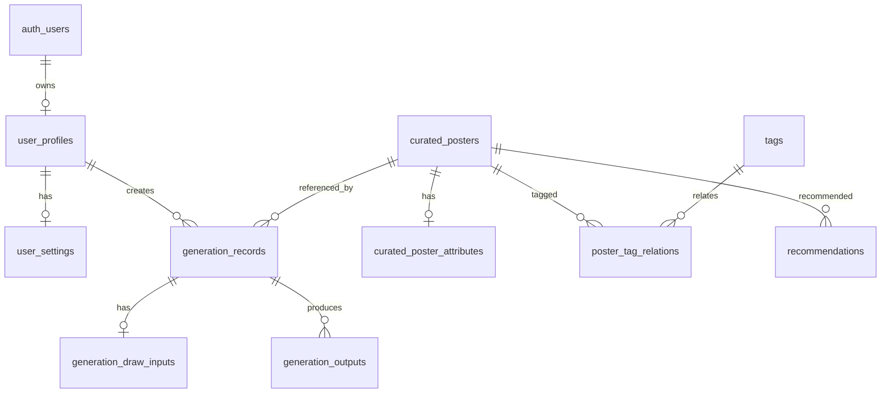

# MoviePainter 数据模型草案

本文档定义 MoviePainter 当前阶段的数据模型草案，用于指导 Supabase 数据库、Storage 与权限策略设计。

当前已经确认的方向是：

- 后台数据由 Supabase 管理
- 官方精选海报库由 Supabase 管理
- 用户所有业务数据由 Supabase 管理

因此，本数据模型以 Supabase 为基线，默认采用：

- Supabase Postgres
- Supabase Auth
- Supabase Storage

## 一、建模目标

需要覆盖的核心数据范围：

- 用户身份
- 用户资料
- 用户设置
- 官方精选海报
- 海报结构化属性
- 参数标签
- 推荐内容
- 生成记录
- 生成结果

## 二、核心实体

### 1. `auth.users`

用途：

- 由 Supabase Auth 管理用户身份

说明：

- 不在业务表中重复保存密码哈希
- 用户认证主数据由 Supabase 托管

关键字段：

- `id`
- `email`
- `created_at`

### 2. `user_profiles`

用途：

- 存储业务层用户资料

建议字段：

| 字段 | 类型 | 说明 |
|---|---|---|
| id | uuid | 主键，同时关联 `auth.users.id` |
| display_name | text | 展示名称 |
| avatar_url | text | 头像地址 |
| role | text | `user` / `admin` |
| status | text | 用户状态 |
| created_at | timestamptz | 创建时间 |
| updated_at | timestamptz | 更新时间 |

### 3. `user_settings`

用途：

- 存储用户个人设置与偏好

建议字段：

| 字段 | 类型 | 说明 |
|---|---|---|
| id | uuid | 主键 |
| user_id | uuid | 关联 `user_profiles.id` |
| preferred_default_mode | text | 默认模式，`chat` / `draw` |
| language | text | 语言偏好 |
| notification_enabled | boolean | 是否启用通知 |
| created_at | timestamptz | 创建时间 |
| updated_at | timestamptz | 更新时间 |

### 4. `curated_posters`

用途：

- 存储官方精选海报主记录

建议字段：

| 字段 | 类型 | 说明 |
|---|---|---|
| id | uuid | 主键 |
| title | text | 海报名称 |
| slug | text | 路由标识 |
| cover_image_url | text | 主图地址 |
| summary | text | 简述 |
| description | text | 详细描述 |
| source_type | text | 来源类型 |
| publish_status | text | 发布状态 |
| sort_order | integer | 排序值 |
| featured | boolean | 是否精选 |
| created_by | uuid | 维护人 |
| created_at | timestamptz | 创建时间 |
| updated_at | timestamptz | 更新时间 |

### 5. `curated_poster_attributes`

用途：

- 存储可被 `AI Draw` 使用的海报结构化属性

建议字段：

| 字段 | 类型 | 说明 |
|---|---|---|
| id | uuid | 主键 |
| poster_id | uuid | 关联海报 |
| character_value | text | 角色特征 |
| style_value | text | 风格特征 |
| mood_value | text | 氛围特征 |
| tone_value | text | 色调特征 |
| composition_value | text | 构图特征 |
| aspect_ratio_value | text | 比例特征 |
| created_at | timestamptz | 创建时间 |
| updated_at | timestamptz | 更新时间 |

说明：

- 这些值可以来自人工维护、标签映射或 AI 预处理结果

### 6. `tags`

用途：

- 存储后台维护的参数标签

建议字段：

| 字段 | 类型 | 说明 |
|---|---|---|
| id | uuid | 主键 |
| name | text | 标签名称 |
| category | text | 标签分类，例如 `style`、`tone` |
| status | text | 标签状态 |
| created_at | timestamptz | 创建时间 |
| updated_at | timestamptz | 更新时间 |

### 7. `poster_tag_relations`

用途：

- 建立海报与标签之间的多对多关系

建议字段：

| 字段 | 类型 | 说明 |
|---|---|---|
| id | uuid | 主键 |
| poster_id | uuid | 关联海报 |
| tag_id | uuid | 关联标签 |
| created_at | timestamptz | 创建时间 |

### 8. `recommendations`

用途：

- 存储海报库或工作区下方灵感区推荐内容

建议字段：

| 字段 | 类型 | 说明 |
|---|---|---|
| id | uuid | 主键 |
| poster_id | uuid | 关联海报 |
| position | text | 推荐投放位置，例如 `library`、`workspace` |
| recommendation_group | text | 推荐分组 |
| sort_order | integer | 排序值 |
| active | boolean | 是否启用 |
| created_at | timestamptz | 创建时间 |
| updated_at | timestamptz | 更新时间 |

### 9. `generation_records`

用途：

- 存储每次生成的主记录

建议字段：

| 字段 | 类型 | 说明 |
|---|---|---|
| id | uuid | 主键 |
| user_id | uuid | 发起用户 |
| mode | text | `chat` / `draw` |
| status | text | `draft` / `queued` / `running` / `succeeded` / `failed` |
| source_poster_id | uuid | 参考海报，可为空 |
| source_origin | text | 来源，例如 `library` / `workspace_inspiration` |
| prompt_text | text | 对话或主提示词 |
| error_message | text | 失败信息 |
| created_at | timestamptz | 创建时间 |
| updated_at | timestamptz | 更新时间 |

### 10. `generation_draw_inputs`

用途：

- 存储 `AI Draw` 模式下的模块输入

建议字段：

| 字段 | 类型 | 说明 |
|---|---|---|
| id | uuid | 主键 |
| generation_id | uuid | 关联生成记录 |
| character_value | text | 角色值 |
| style_value | text | 风格值 |
| mood_value | text | 氛围值 |
| tone_value | text | 色调值 |
| composition_value | text | 构图值 |
| aspect_ratio_value | text | 比例值 |
| selected_modules_json | jsonb | 用户选中的模块集合 |
| weights_json | jsonb | 各模块权重 |
| created_at | timestamptz | 创建时间 |
| updated_at | timestamptz | 更新时间 |

### 11. `generation_outputs`

用途：

- 存储生成结果

建议字段：

| 字段 | 类型 | 说明 |
|---|---|---|
| id | uuid | 主键 |
| generation_id | uuid | 关联生成记录 |
| image_url | text | 结果图片地址 |
| thumbnail_url | text | 缩略图地址 |
| width | integer | 宽度 |
| height | integer | 高度 |
| output_order | integer | 结果顺序 |
| created_at | timestamptz | 创建时间 |

## 三、Storage 规划

建议在 Supabase Storage 中至少建立以下 buckets：

- `poster-assets`
- `generation-outputs`
- `user-uploads`
- `avatars`

用途：

- `poster-assets`：官方精选海报与素材
- `generation-outputs`：生成结果图
- `user-uploads`：用户上传素材
- `avatars`：用户头像

## 四、实体关系

## 五、与页面的对应关系

### 营销 landing 页

当前阶段不强依赖业务表，可主要使用静态内容或配置化内容。

### 海报库页

主要依赖：

- `curated_posters`
- `curated_poster_attributes`
- `tags`
- `poster_tag_relations`
- `recommendations`

### 生成工作区页

主要依赖：

- `curated_posters`
- `curated_poster_attributes`
- `generation_records`
- `generation_draw_inputs`
- `generation_outputs`

### 历史生成记录页

主要依赖：

- `generation_records`
- `generation_outputs`

### 个人设置页

主要依赖：

- `user_profiles`
- `user_settings`

## 六、Row Level Security 草案

建议首批 RLS 原则如下：

### 用户自己的数据

- 用户只能读取和修改自己的 `user_profiles`
- 用户只能读取和修改自己的 `user_settings`
- 用户只能读取自己的 `generation_records`
- 用户只能读取自己的 `generation_outputs`

### 官方精选内容

- 普通用户可读取已发布的 `curated_posters`
- 普通用户可读取已启用的 `recommendations`
- 普通用户不可直接修改海报库内容

### 管理员内容

- 具有 `admin` 角色的用户可维护官方精选海报、标签与推荐内容
- 当前阶段这类维护动作主要通过 Supabase Studio 完成

## 七、MVP 最小可落地集合

如果按最小可运行版本优先落地，建议先做：

- `auth.users`
- `user_profiles`
- `user_settings`
- `curated_posters`
- `curated_poster_attributes`
- `generation_records`
- `generation_draw_inputs`
- `generation_outputs`

第二阶段再补：

- `tags`
- `poster_tag_relations`
- `recommendations`

## 八、当前建模约束

- 历史生成记录页可直接基于 `generation_records + generation_outputs` 生成，不必单独再建“历史表”
- 用户认证主数据不要与业务资料表混在一起
- `AI Draw` 的九个维度建议先通过 `selected_modules_json + weights_json + prompt_text` 承载，后续再把稳定高频维度拆成结构化字段
- 权重与多选结果可先用 `jsonb` 承载，后续再视复杂度细拆
