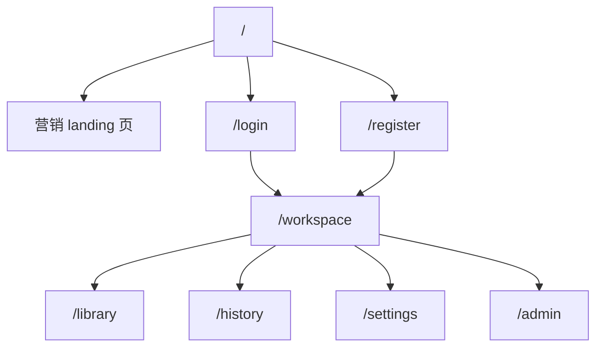
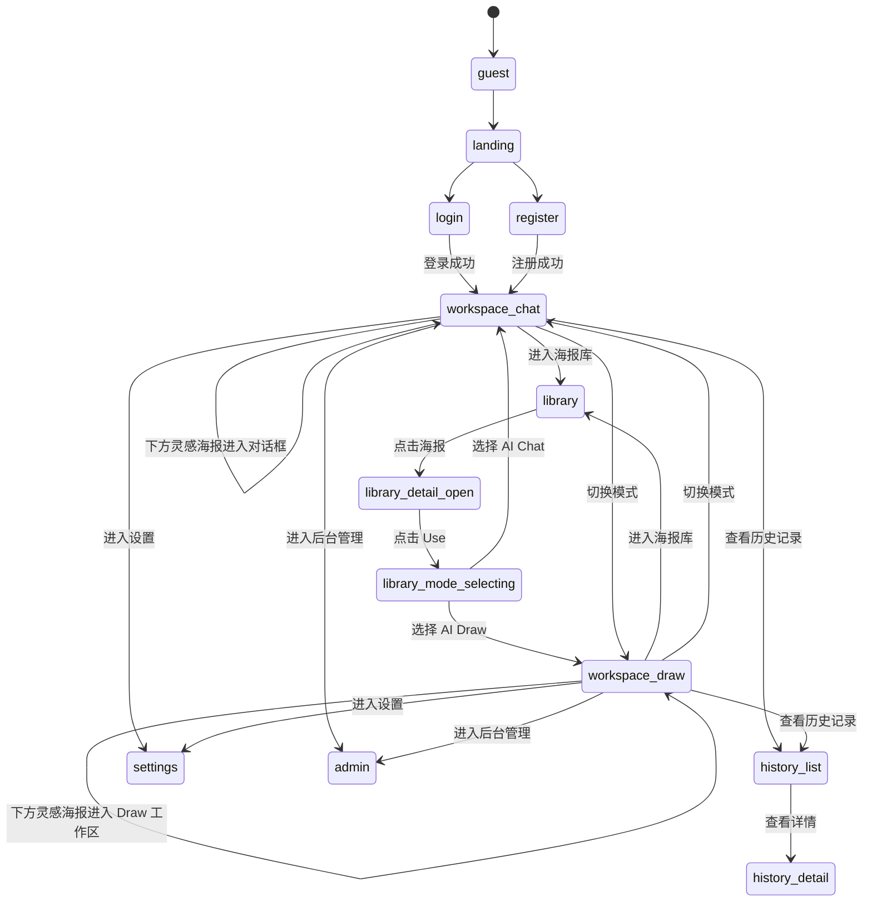

# MoviePainter 页面路由地图

本文档定义 MoviePainter 当前阶段的页面路由结构、访问权限，以及用户在应用内的轻量状态流。

当前有一个重要前提：

- 后台数据管理
- 官方精选海报库管理
- 用户数据管理

统一通过 Supabase 管理。

当前阶段页面既包含用户侧页面，也包含一个应用内后台管理页占位版本。

真实数据维护仍然以 Supabase Studio 为主，但应用内会提前建设后台工作台结构，便于后续接入。

## 一、当前页面路由总览

## 二、用户侧路由

| 路由 | 页面 | 访问权限 | 说明 |
|---|---|---|---|
| `/` | 营销 landing 页 | 公开 | 未登录默认入口 |
| `/login` | 登录页 | 公开 | 用户登录 |
| `/register` | 注册页 | 公开 | 用户注册 |
| `/workspace` | 生成工作区页 | 登录后 | 登录成功后的默认主工作台 |
| `/library` | 海报库页 | 登录后 | 浏览官方精选海报与进入创作 |
| `/history` | 历史生成记录页 | 登录后 | 查看个人历史生成记录 |
| `/settings` | 个人设置页 | 登录后 | 管理个人账户与偏好 |
| `/admin` | 后台管理页 | 登录后 | 管理官方精选库、详情、标签、推荐位与用户数据的占位后台 |

## 三、后台管理方式

当前阶段同时存在两种后台管理方式：

- `/admin`：应用内后台管理页，占位版本，先搭建管理结构与交互
- Supabase Studio：真实数据维护主入口

当前由后台管理能力覆盖的内容包括：

- 官方精选海报库
- 海报详情信息与标签
- 推荐内容
- 用户主数据
- 用户历史数据

## 四、推荐的路由参数与状态表达

### 1. 海报库页

推荐支持：

- `/library`
- `/library?filter=...`
- `/library?posterId=123`

用途：

- 表达筛选结果
- 表达当前弹窗海报

### 2. 生成工作区页

推荐支持：

- `/workspace`
- `/workspace?mode=chat`
- `/workspace?mode=draw`
- `/workspace?mode=chat&posterId=123`
- `/workspace?mode=draw&posterId=123`

用途：

- 表达当前模式
- 表达从海报库页带入的参考海报

### 3. 历史生成记录页

推荐支持：

- `/history`
- `/history/:generationId`

用途：

- 列表页
- 详情查看

## 五、用户操作工作流的轻量状态机

本项目在用户操作工作流期间，建议引入“轻量状态机”机制，但不引入过重的流程引擎。

这里的“轻量状态机”指：

- 以页面路由为主状态边界
- 以页面内局部状态为子状态
- 优先使用前端可维护的状态表达
- 明确用户当前所处流程步骤，避免交互黑箱

### 1. 设计目标

这套轻量状态机主要解决以下问题：

- 用户当前是否已经登录
- 当前是否处于海报浏览、详情查看、模式选择、工作区创作、生成提交或结果查看阶段
- 当前工作区模式是 `AI Chat` 还是 `AI Draw`
- 当前是否已有参考海报
- 当前生成流程处于编辑中、提交中、成功或失败状态

### 2. 建议状态层次

建议拆成 4 层轻量状态：

- `auth state`
- `route state`
- `workspace state`
- `generation state`

### 3. auth state

| 状态 | 说明 |
|---|---|
| `guest` | 未登录 |
| `authenticated` | 已登录 |

### 4. route state

| 状态 | 说明 | 对应路由 |
|---|---|---|
| `landing` | 营销页浏览 | `/` |
| `login` | 登录中 | `/login` |
| `register` | 注册中 | `/register` |
| `library` | 海报库浏览 | `/library` |
| `library_detail_open` | 海报详情弹窗打开 | `/library?posterId=xxx` |
| `library_mode_selecting` | 已点击 `Use`，等待用户选择模式 | `/library?posterId=xxx` |
| `workspace_chat` | 工作区 `AI Chat` 模式 | `/workspace?mode=chat` |
| `workspace_draw` | 工作区 `AI Draw` 模式 | `/workspace?mode=draw` |
| `history_list` | 历史记录列表 | `/history` |
| `history_detail` | 历史记录详情 | `/history/:generationId` |
| `settings` | 个人设置 | `/settings` |
| `admin` | 后台管理页 | `/admin` |

### 5. workspace state

| 状态 | 说明 |
|---|---|
| `empty` | 当前工作区没有参考海报 |
| `poster_attached` | 当前工作区已挂载参考海报 |
| `chat_editing` | `AI Chat` 模式下正在编辑对话 |
| `draw_editing` | `AI Draw` 模式下正在编辑参数 |

### 6. generation state

| 状态 | 说明 |
|---|---|
| `idle` | 尚未发起生成 |
| `drafting` | 正在编辑输入 |
| `ready` | 可以提交生成 |
| `submitting` | 正在提交 |
| `succeeded` | 生成成功 |
| `failed` | 生成失败 |

### 7. 关键工作流状态机

### 8. 前端落地建议

建议不要一开始上复杂状态机框架，而是用“路由状态 + 页面局部 reducer/state”实现：

- 路由负责表达页面级状态
- query 参数负责表达模式、海报选择等轻量上下文
- 页面内 state 或 reducer 负责表达弹窗开关、模式切换、生成提交状态

建议首批状态字段：

- `authStatus`
- `currentRoute`
- `workspaceMode`
- `selectedPosterId`
- `libraryModalState`
- `generationStatus`

### 9. 海报库到工作区的状态规则

海报库页中的状态机必须保证：

- 先浏览海报
- 再打开详情
- 再点击 `Use`
- 再选择 `AI Chat / AI Draw`
- 再跳转到目标工作区

禁止跳过“模式选择”直接进入工作区。

### 10. 生成工作区页内的状态规则

生成工作区页中的状态机必须保证：

- 用户先有当前模式
- 再从下方灵感区选择海报
- 所选海报直接注入当前模式对应的工作区

具体表现为：

- `AI Chat` 模式下，海报进入对话框上下文
- `AI Draw` 模式下，海报进入 `AI Draw` 工作区展示区

## 六、跳转规则

### 未登录用户

- 默认进入 `/`
- 若访问 `/workspace`、`/library`、`/history`、`/settings`，应被拦截并导向 `/login`

### 已登录用户

- 登录成功后默认进入 `/workspace`
- 可访问 `/library`、`/history`、`/settings`

### 管理员与运营人员

- 当前不通过应用内页面进行后台维护
- 统一通过 Supabase Studio 管理后台数据、海报库与用户数据

## 七、关键路由跳转

### 海报库到工作区

- `/library`
- 点击海报
- 打开详情弹窗
- 点击 `Use`
- 选择 `AI Chat / AI Draw`
- 跳转到 `/workspace?mode=chat|draw&posterId=xxx`

### 工作区内切换模式

- `/workspace?mode=chat`
- 用户切换模式
- `/workspace?mode=draw`

### 历史记录查看详情

- `/history`
- 点击某条记录
- `/history/:generationId`
