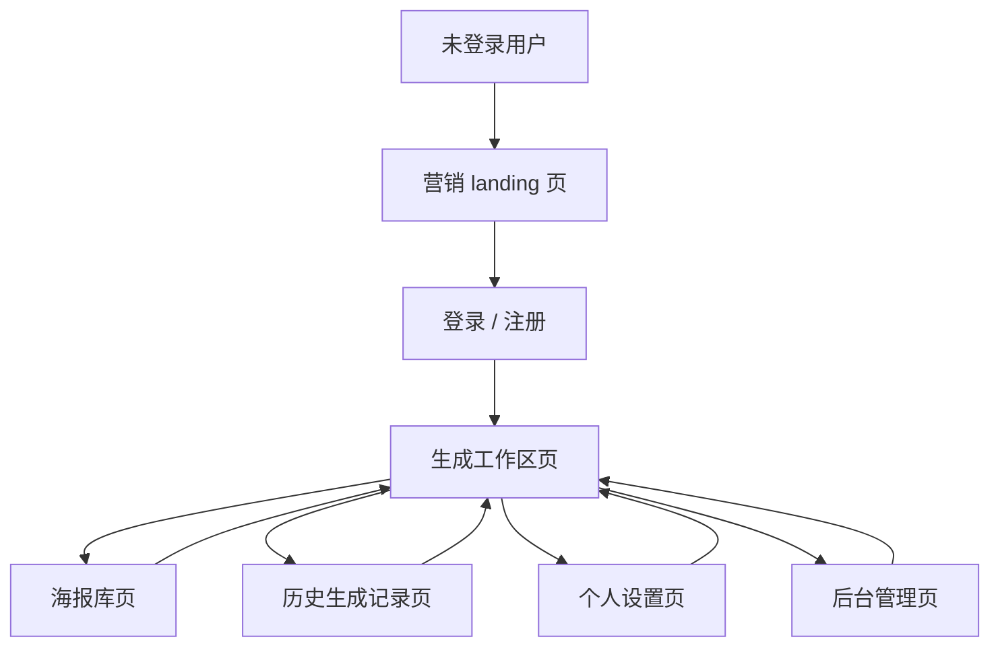
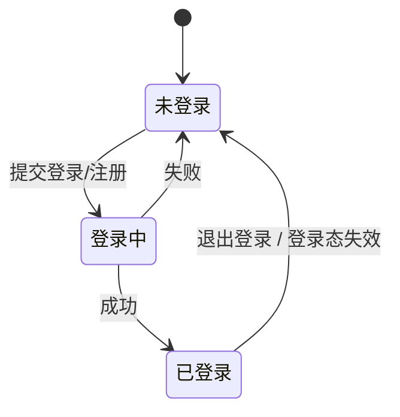
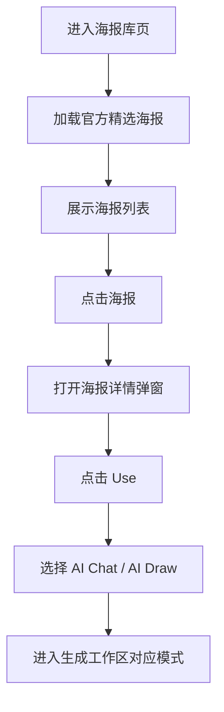
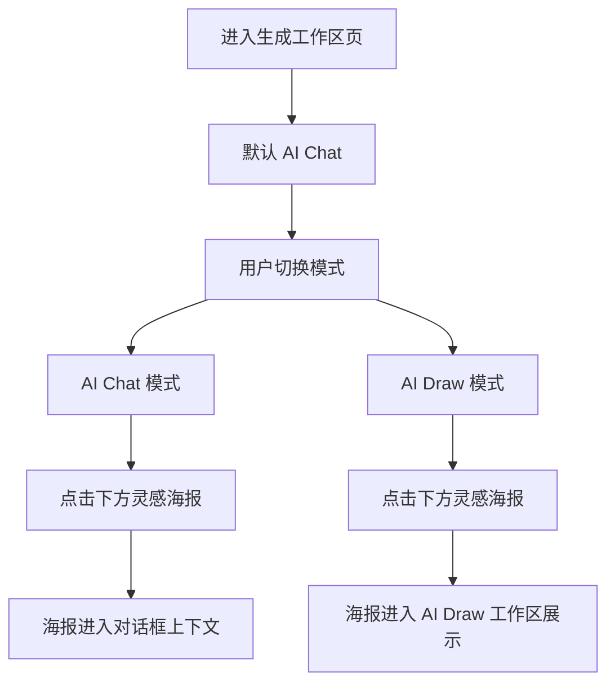
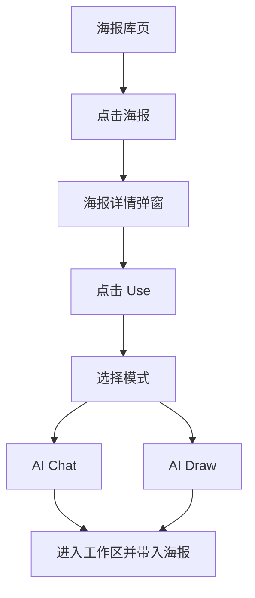
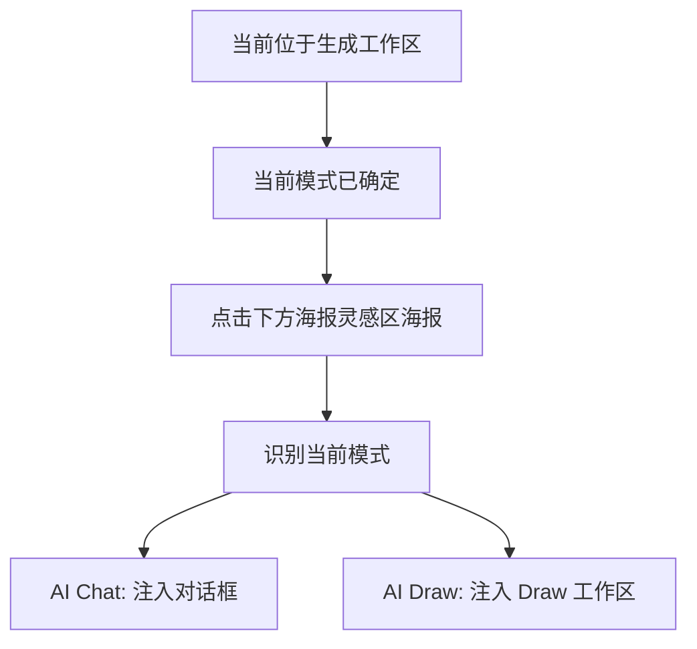
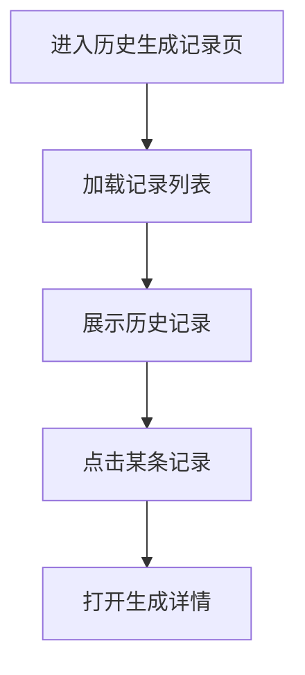
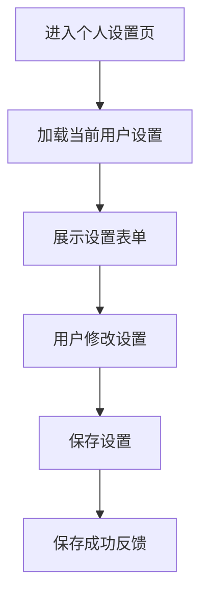

# MoviePainter 页面状态流转图

本文档描述 MoviePainter 当前阶段的页面状态流转与关键交互流程。

## 一、全局页面状态流转

## 二、登录状态流转

## 三、海报库页状态流转

## 四、生成工作区页状态流转

## 五、海报库进入工作区的状态流转

## 六、工作区内灵感海报使用流转

这是和海报库页不同的一条逻辑。

海报库页：

- 先看详情
- 再点 `Use`
- 再选模式

生成工作区页：

- 用户已经先处于当前模式
- 直接在下方灵感区选择海报
- 海报直接进入当前模式对应的工作区

## 七、历史生成记录页状态流转

## 八、个人设置页状态流转

